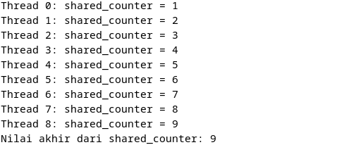

  <h2 style="text-align: center;font-weight: bold">Praktikum 12 
Praktek Sistem Operasi </h2>
  <h4 style="text-align: center;">Dosen Pengampu : Dr. Ferry Astika Saputra, S.T., M.Sc.</h4>

 

  
  <h3 style="text-align: center;">Disusun Oleh :  Kelompok 4</h3>
  

    <strong>Muhammad Yafi Rifdah Zayyan (3123500001)</strong> 
    <strong>Muhammad Daffa Erfiansyah (3123500006)</strong> 
    <strong>Maula Shahihah Nur Sa'adah (3123500008)</strong>

  

<h3 style="text-align: center;line-height: 1.5">Politeknik Elektronika Negeri Surabaya Departemen Teknik Informatika Dan Komputer Program Studi Teknik Informatika 2023/2024</h3>
  

## TUGAS SOAL 2 (MUTEX)
### Program tanpa mutex
###### Output : 

###### Analisa : 
Program diaats mencoba  memiliki masalah utama berupa kondisi balapan (race condition) karena `shared_counter` ditingkatkan oleh setiap `thread` tanpa menggunakan mekanisme penguncian, seperti `mutex`. Ini menyebabkan potensi akses dan pembaruan bersamaan oleh beberapa `thread`, menghasilkan nilai shared_counter yang tidak akurat. Selain itu, argumen yang diteruskan ke `pthread_create` untuk ID `thread` tidak akurat, yang dapat menyebabkan informasi ID thread yang salah dicetak. Hal ini membuat program tidak aman untuk digunakan dalam lingkungan multi-threaded dan dapat menghasilkan output yang tidak dapat diprediksi atau salah.

### Program dengan mutex
###### Output : 

###### Analisa : 
Program kedua menggunakan mekanisme penguncian dengan mutex untuk memastikan akses aman ke shared_counter dalam lingkungan multi-threaded, sehingga mencegah kondisi balapan `(race condition)`. Setiap thread mengunci mutex sebelum mengakses dan memperbarui `shared_counter`, lalu melepaskan `mutex` setelah selesai. Ini memastikan bahwa hanya satu thread yang dapat mengakses `shared_counter` pada satu waktu, menjaga konsistensi nilai. Selain itu, program dengan benar meneruskan indeks thread sebagai argumen ke `pthread_create`, memastikan bahwa informasi ID thread yang dicetak akurat. Secara keseluruhan, program kedua lebih aman dan andal dalam menangani akses ke variabel global yang dibagikan di antara beberapa thread.
