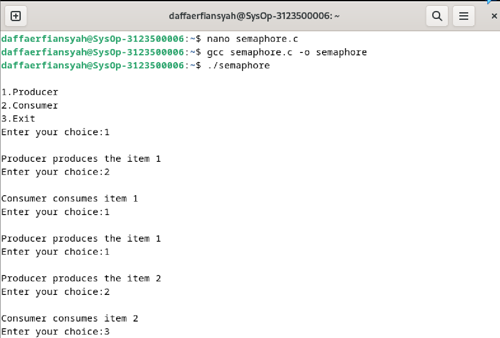
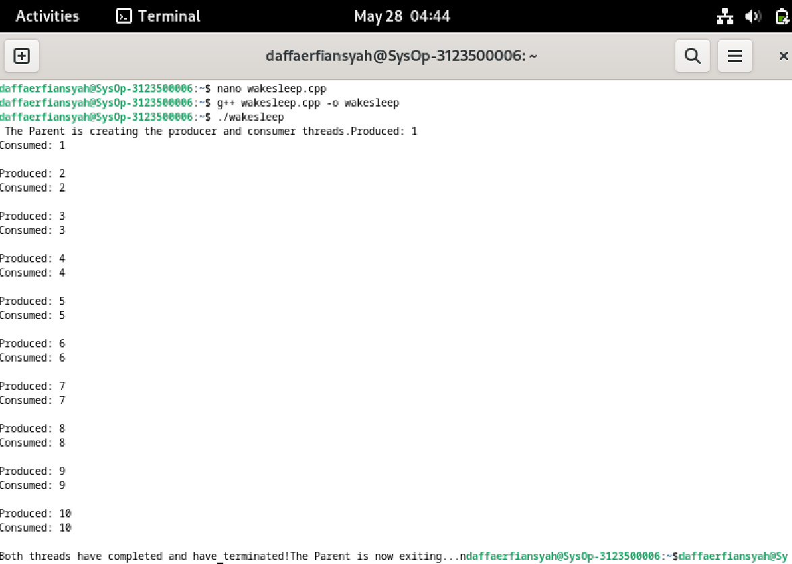

  <h1 class="text-align: center;font-weight: bold">Praktikum 9 Sistem Operasi</h1>
  <h3 class="text-align: center;">Dosen Pengampu : Dr. Ferry Astika Saputra, S.T., M.Sc.</h3>

 

  
  <h3 style="text-align: center;">Disusun Oleh :  Kelompok 4</h3>
  

    <strong>Muhammad Yafi Rifdah Zayyan (3123500001)</strong> 
    <strong>Muhammad Daffa Erfiansyah (3123500006)</strong> 
    <strong>Maula Shahihah Nur Sa'adah (3123500008)</strong>
  

<h3 style="text-align: center;line-height: 1.5">Politeknik Elektronika Negeri Surabaya Departemen Teknik Informatika Dan Komputer Program Studi Teknik Informatika 2023/2024</h3>
  

## Producer Consumer Semaphore

Analisis : 

Dalam konteks producer-consumer, semaphore digunakan untuk mengontrol akses ke buffer yang digunakan untuk mentransfer data antara producer dan consumer. Masalah ini muncul ketika producer dan consumer memiliki kecepatan yang berbeda, yang dapat menyebabkan buffer menjadi penuh atau kosong. Menu yang terdapat dalam program diatas terdapat 3 menu, yaitu pertama Producer, kedua Consumer, dan ketiga Exit. Masalah ini muncul ketika producer dan consumer memiliki kecepatan yang berbeda, yang dapat menyebabkan buffer menjadi penuh atau kosong. Menu pertama Producer adalah untuk membuat data dengan maximal data sebanyak 3, jika user memilih opsi 1 berturut-turut sampai lebih dari 3 kali maka akan mencetak pesan "Buffer is full!!" yang mengartikan bahwa storage buffer sudah penuh. Begitu juga sebaliknya jika user memilih menu kedua secara berturut-turu sampai lebih dari 3 kali, maka akan mencetak pesan "Buffer is empty!!" yang menandakan bahwa buffer sudah kosong/tidak ada isinya. Menu ketiga untuk keluar dari program.

## Producer Consumer Wake-Sleep thread

Analisis : 

Dalam kasus ini, program diatas menggunakan thread untuk menjalankan produsen dan konsumen secara bersamaan. Dengan menggunakan mekanisme seperti kunci gembok (mutex) dan lampu lalu lintas (variabel kondisi), program memastikan bahwa hanya satu proses yang dapat mengakses sumber daya pada satu waktu. Saat produsen menghasilkan sesuatu, ia memberitahu konsumen dengan cara mengirim sinyal bahwa ada barang baru yang tersedia. Begitu juga ketika konsumen mengonsumsi barang, ia memberi tahu produsen dengan cara mengirim sinyal bahwa ia sudah mengambil barang tersebut. Dengan demikian, program memastikan bahwa proses produksi dan konsumsi berjalan dengan aman dan terkoordinasi.

### Referensi

- [Producer Consumer Problem](https://www.geeksforgeeks.org/producer-consumer-problem-in-c/)